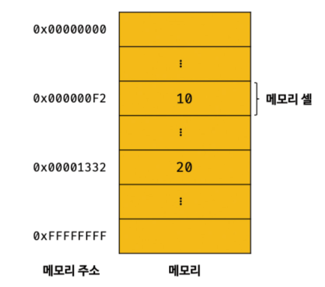
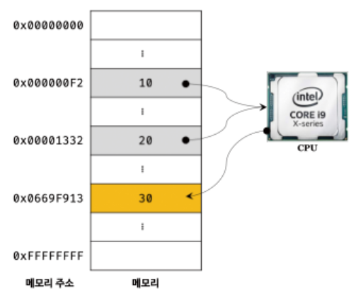
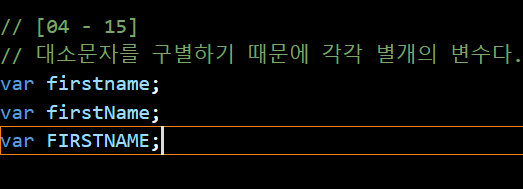
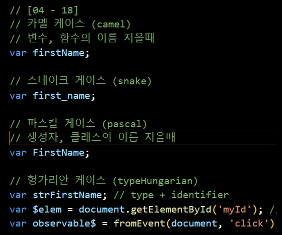

# 챕터4. 변수(Variable)

 - **변수란 무엇인가**
    - 애플리케이션(Application)은 데이터를 다루며, **입력(Input)을 받아** 처리하고, 그 **결과를 출력(Output)한다.**

    EX ) `10 + 20`

    - 자바스크립트 엔진이 위 자바스크립트를 **계산(평가 evaluation)** 하려면

    - 10,20,+라는 **기호(리터럴(literal), 연산자(operator))** 의 의미를 알고 있어야 하며, 10 + 20이라는 **식(표현식 (expression))** 의 의미도 **해석(파싱 (parsing))** 할 수 있어야 한다.

---

 <h1>4.1 메모리(Memory) </h1>




  - 자바스크립트 엔진은 좌변과 우변의 숫자 값, 즉 **피연산자(operand)를 기억** 한다.

  - 컴퓨터는 **CPU를 사용해 연산**하고, **메모리를 사용해 데이터를 기억**한다.

  - 메모리는 **데이터를 저장할 수 있는 메모리 셀(memory cell)의 집합체**이며, **셀 하나의 크기는 1Byte(8비트)**, 컴퓨터는 **1바이트 단위로 데이터를 저장(write)하거나 읽어(read)** 들인다.

  - 컴퓨터는 모든 데이터를 2진수로 처리하기에 데이터의 종류(숫자, 텍스트, 이미지, 동영상) 상관없이 
  모든 데이터를 2진수로 저장


<br>



  - 10 + 20 연산을 통해 새로운 값 30을 생성하고, 메모리에 저장

  - cpu가 연산해서 만든 숫자 값 30을 재사용 X
    
  - 만약 재사용하고 싶다면 메모리 주소를 통해 직접 값에 접근하는 것 외엔 방법 X

  - 메모리 주소를 통해 직접 값을 접근하는 건 위험하며, 값이 저장될 메모리 주소는 코드가 실행될때마다 변경된다.(결론은 값이 저장된 메모리 주소를 알 수 없음)

  - 값을 저장하고, 저장한 값을 읽어 들여 재사용하기 위해
    변수(Variable)라는 매커니즘을 제공한다.

<hr>

변수는 <br>

하나의 값을 저장하기 위해 확보한 **메모리 공간 자체**나 그 메모리 공간을 **식별하기 위해 붙인 이름**

메모리 공간에 저장된 값을 식별할 수 있는 고유한 이름 **변수 이름**(변수명)<br>
변수에 저장된 값 ( 예제 - 30 )을 **변수 값** , 변수에 값을 저장하는 것을 **할당 (assignment)** <br> 
저장된 값을 읽어 들이는 것 **참조(reference)**
<hr>
<br>

# 4.2 식별자(Identifier)

변수 이름을 식별자라고도 한다.<br>

어떤 값을 구별해서 식별할 수 있는 고유한 이름

식별자는 값을 저장한 메모리 주소를 기억하는 것이며, 메모리 주소와 매핑 관계를 맺으며, 매핑 정보도 메모리에 저장한다.

<hr>

<br>

# 4.3 변수선언

<h3>변수 선언은 변수를 생성하는 것</h3><br>

값을 저장하기 위한 메모리 공간을 확보 -> 변수 이름과 확보된 메모리 공간의 주소를 연결해서 값을 저장할 수 있게 준비

<h3>변수를 선언하려면 var, let, const 키워드를 사용</h3>

변수를 선언한 이후 **아무런 값을 할당해주지 않으면 undefind**라는 값을 암묵적으로 할당되어 초기화 **(메모리 공간이 비는 건 아님)**

    undefind는 자바스크립트에서 제공하는 원시의 타입(primitive value)이다.

자바스크립트 엔진은 변수 선언을 2단계에 거쳐 수행

 1. 선언 단계 - 변수 이름을 등록해서 자바스크립트 엔진에 변수의 존재를 알림
 2. 초기화 단계 - 값을 저장하기 위한 메모리 공간을 확보하고 암묵적으로 undefined를 할당해 초기화

<br><h4>변수의 이름은 어디에 등록되는가?</h4>
  
    변수 이름을 포함한 모든 식별자는 실행 컨텍스트(execution context)에 등록

    자바스크립트 엔진이 소스코드를 평가하고 실행하기 위해 필요한 환경을 제공하고
    
    코드의 실행 결과를 실제로 관리하는 영역
    
    자바스크립트 엔진은 실행 컨텍스트를 통해 식별자와 스코프를 관리

    변수 이름과 변수 값은 실행 컨텍스트 내에 키(key)/값(value) 형식인 객체로 등록되어 관리

<hr>

# 4.4 변수 호이스팅 [ ⭐ ]

```
console.log(score); // undefined
var score;
```

자바스크립트 코드는 인터프리터에 의해 한 줄씩 순차적으로 실행된다.<br>

변수 선언문보다 변수를 참조하는 코드가 앞에 있기에, Reference Error(참조 에러)가 발생할 것 같지만, Undefined가 출력된다.

이유는 **변수 선언이 소스코드가 한 줄씩 순차적으로 실행되는 시점, 즉 런타임(runtime)이 아니라 그 이전 단계에서 실행**되기 때문


이처럼 **변수 선언문이 코드의 선두로 끌어 올려진 것처럼 동작**하는 자바스크립트의 고유의 특징을 **변수 호이스팅(variable hoisting)** 이라 한다.

자고로, 모든 선언문들은 런타임 이전 단계에서 실행되기에 var, let, const, function, function*, class (변수,함수,클래스)도 호이스팅이 된다.
<hr>
<h3>4.4.1 TDZ( Temporal Dead Zone )</h3>
<br>

let이나 const로 선언된 변수가 실제로 초기화 되기 전까지 접근할 수 없는 영역을 말함

변수가 선언된 위치로부터 초기화 되기전까지의 영역이 TDZ에 해당되며, 이 구간에서 해당 변수에 접근하려고 하면 Reference Error(참조 에러)가 발생

예시 )
```
console.log(a); // ReferenceError : Cannot access 'a' before initialization

let a = 10;
```
TDZ를 통해 코드의 안정성을 높이고 예측 가능성을 보장한다.

<hr>

# 4.5 값의 할당

변수의 값을 할당(assignment, (대입, 저장) )할 때는 할당 연산자 =를 사용

```
var score; // 변수 선언
score = 80; // 값의 할당
```

변수 선언과 할당을 하나의 문(statement)로 단축 표현
```
var score = 80; // 변수 선언과 값의 할당
```

자바스크립트 엔진은 하나의 문으로 단축 표현해도 변수의 선언과 값의 할당을 2개의 문으로 나누어 각각 실행

주의할 점은 **변수 선언은 소스코드가 순차적으로 실행되는 시점인 런타임 이전에 먼저 실행(hoisting)** 되지만, **값의 할당은 런타임시점에 실행**된다

```
[04-08]

console.log(score); // undefined

var score; // 변수 선언
score = 80; // 값의 할당

console.log(score); // 80
```

<hr>

# 4.6 값의 재할당

재할당이란 **이미 값이 초기화되어 있는 변수에 새로운 값을 또다시 할당** 하는 것

```
var score = 80; // 변수 선언과 값의 할당
score = 90; // 값의 재할당
```

변수는 재할당을 통해 변수에 저장된 값을 변경할 수 있다.<br>

반대로 **값을 재할당 할 수 없어서 값을 변경할 수 없는건 상수(constant)** 라 한다

재할당하고 난 이후 나머지 값들은 불필요해진다.(재할당해도 새로운 공간에 저장되는거라 값이 남기때문)

이러한 값들은 가비지 콜렉터에 의해 메모리에서 자동 해제

```
가비지 콜렉터(Garbage Collector)

애플리케이션이 할당(allocate)한 메모리 공간을 주기적으로 검사하여 더 이상 사용되지 않는 메모리를 해제(release)하는 기능

더 이상 사용되지 않는 메모리란 어떠 식별자도 참조하지 않는 메모리 공간을 의미

자바스크립트는 가비지 콜렉터를 내장하고있어 가비지 콜렉터를 통해 메모리 누수(memory leak)를 방지
```
```
언매니지드(Unmanaged)와 매니지드(managed)

C언어 같은 언매니지드 언어는 malloc()과 free()같은 메모리 제어 기능을 제공하여, 개발자가 메모리 제어를 주도함

자바스크립트 같은 매니지드 언어는 메모리의 할당 해제등 메모리 관리 기능을 언어 차원에서 담당

개발자가 직접적인 메모리 제어를 허용 X, 명시적으로 메모리를 할당하고 해제 X, 가비지 콜렉터 또한 관여 X

언매니지드 장점은 개발자의 역량에 따라 최적의 성능을 확보가능, 단점은 치명적 오류를 생산할 가능성이 존재

매니지드 장점은 개발자의 역량 의존 부분이 작아져 생산성을 확보할 수 있다는 점, 단점은 성능면에서 어느 정도의 손실을 감수해야됨
```
<hr>

# 4.7 식별자 네이밍 규칙

식별자(identifier)는 이름을 지을때 다음과 같은 규칙을 준수해야 한다.

문자(특수문자 제외), 숫자, 언더스코어( _ ), 달러 기호($) 사용가능 O (단, 숫자로 시작하는 건 허용 X)

예약어 사용 X (예시적으로 if, break, catch, case)


대소문자도 구별하기에 변수가 다 따로 담긴다


변수의 이름은 존재 목적을 쉽게 이해할 수 있게 명확히 표현하는 것이 좋다

네이밍 컨벤션 (Naming Convention)은 하나 이상의 영어 단어로 구성된 식별자를 만들 대 가독성이 좋게하기 위해 규정한 명명 규칙이다.



일반적으로 **변수, 함수의 이름** 지을때 **카멜 케이스 (camel Case)**,<br>
          **생성자, 클래스의 이름** 지을때 **파스칼 케이스 (pascal Case)** 를 많이 사용한다.