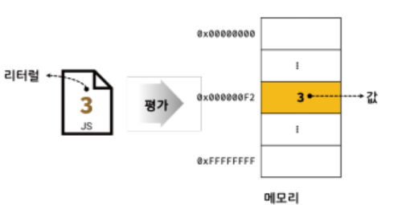
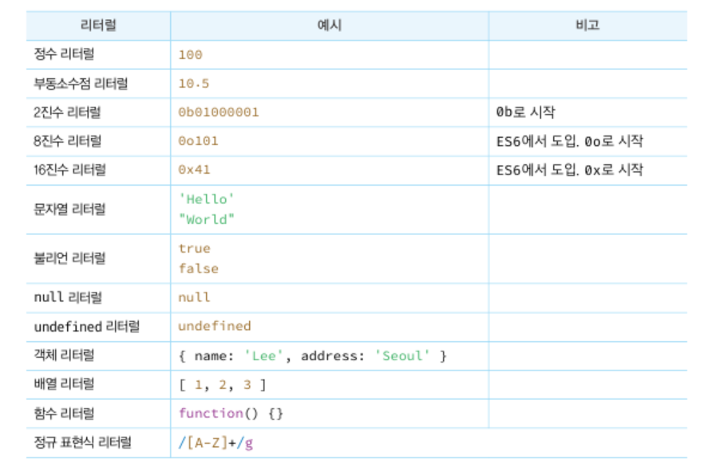
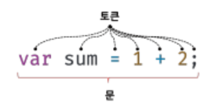

# 챕터5. 표현식(Expression)과 문(statement)

  ### 5.1 값 (Value)
  
  **값(Value)은 식(표현식 Expression)이 평가(evaluate) 되어 생성된 결과**다.

```
// 10 + 20 평가 -> 숫자 30을 생성

10 + 20;
```

모든 값은 데이터 타입을 가지며, 메모리에 2진수 비트(bit)의 나열로 저장

메모리에 저장된 값은 데이터 타입에 따라 다르게 해석된다

ex) 메모리에 저장된 값 0100 0001을 숫자로 해석하면 65이고, 문자로 해석하면 'A'다

```
// 변수에는 10 + 20이 평가되어 생성된 숫자 값 30 할당

var sum = 10 + 20;
```

변수는 하나의 값을 저장한다

위 예제의 sum 변수에 할당되는 것은 10 + 20이 평가된 결과인 숫자 값 30이 메모리에 저장된다.

<hr>

### 5.2 리터럴(literal)

**리터럴(literal)** 은 **사람이 이해할 수 있는 문자** 또는 **약속된 기호를 사용해 값을 생성 하는 표기법(notation)** 을 말한다.

```
// 숫자 리터럴 3

3
```

숫자 리터럴 3을 코드에 기술하면 자바스크립트 엔진은 런타임에 이를 평가해 숫자 값 3을 생성



리터럴은 값을 생성하기 위해 미리 약속한 표기법이라고 할 수 있으며, 리터럴을 사용하면 다양한 종류의(data type)의 값을 생성할 수 있다.



<hr>

### 5.3 표현식(expression)

**표현식(expression)** 은 **값으로 평가될 수 있는 문(statement)** 이며, **표현식이 평가되면 새로운 값을 생성** 하거나 **기존 값을 참조** 한다

```
var score = 100;
```

위 리터럴 100은 자바스크립트 엔진에 의해 평가되어 값을 생성하므로 리터럴은 그 자체로 표현식이다

```
score; // -> 100
```

변수 식별자를 참조하면 변수 값으로 평가되며 값을 생성하지는 않지만 참조하므로 값으로 평가되어 표현식이다.

결론적으로 값으로 평가될 수 있는 문은 모두 표현식이다.

```
var x = 1 + 2;

// 식별자 표현식 x는 3으로 평가된다.
x + 3; // -> 6
``` 

좌항 x는 식별자 표현식이다.<br>
 x는 할당되어 있는 숫자 값 3으로 평가되며 숫자 값이 위치해야 할 자리에 표현식 x를 사용할 수 있다.<br> 
 이처럼 표현식은 다른 표현식의 일부가 되어 새로운 값을 만들 수 있다.

<hr>

 ### 5.4 문(statement)

 **문(statement)** 은 **프로그램을 구성하는 기본 단위이자 최소 실행 단위**다.

 문의 집합으로 이뤄진 것이 바로 프로그램이며, 문을 작성하고 순서에 맞게 나열하는 것이 프로그래밍이다.

 문은 여러 토큰으로 구성된다.<br>
 **토큰(token)이란 문법적인 의미를 가지며, 문법적으로 더 이상 나눌 수 없는 코드의 기본 요소** 를 의미한다.



위 그림 순서대로 키워드, 식별자, 연산자, 리터럴, 세미콜론이나 마침표등의 특수 기호는 문법적인 의미를 가지며, 문법적으로 더 이상 나눌 수 없으므로 모두 토큰이다.

문은 선언문, 할당문, 조건문 , 반복문 등으로 구분할 수 있다.

```
// 선언
var x;

// 할당
x = 5;

// 함수 선언
function foo () {}

// 조건
if (x > 1) { console.log(x);}

// 반복
for ( var i = 0; i < 2; i++) {console.log(i);}
```

### 5.5 세미콜론(Semicolon)과 세미콜론 자동 삽입 기능(ASI)

세미콜론(;)은 문의 종료를 나타낸다.<br>
자바스크립트 엔진은 세미콜론을 기준으로 문이 종료한 위치를 파악하고<br>

 순차적으로 하나씩 문을 실행하기에<br>
문을 끝낼 때는 세미콜론을 붙여야 한다.

단, **중괄호로 묶은 코드 블록 {...} (if문, for문, 함수) 뒤에는 세미콜론을 붙이지 않는다.**

이러한 코드 블록은 언제나 문의 종료를 의미하는 **자체 종결성(self closing)** 을 갖기 때문이다.

자바스크립트 엔진이 소스코드를 해석할 때 문의 끝이라고 예측되는 지점에<br>

 **세미콜론을 자동으로 붙여주는 세미콜론 자동 삽입 기능(ASI (Automatic Semicolon Insertion))** 이 암묵적으로 수행되므로 <br>
 세미콜론은 생략이 가능하다.

 하지만 ASI기능의 동작과 개발자의 예측이 일치하지 않는 경우가 간혹 존재하기에 <br>
 왠만하면 세미콜론을 사용하는 것이 권장된다.

<hr>

### 5.6 표현식인 문과 표현식이 아닌 문

```
변수선언문은 값으로 평가될 수 없으므로 표현식이 아니다.

var x;

1, 2, 1 + 2, x = 1 + 2는 모두 표현식이다.

x = 1 + 2;
```

문(statement)에는 표현식인 문과 표현식이 아닌 문이 있다.<br>

표현식인 문은 값으로 평가되며, 표현식이 아닌 문은 값으로 평가될 수 없다.

**표현식이 아닌 문과 표현식인 문을 가장 간단하게 구별하는 방법은 변수를 할당해보는 것이다.**

```
// 표현식이 아닌 문은 값처럼 사용할 수 없다.
var foo = var x; // SyntaxError: Unexpected token var
```

위 처럼 변수 선언문은 표현식이 아니기에 값으로 평가될 수 없기에 따라서 변수 선언문은 값처럼 사용할 수 없다.